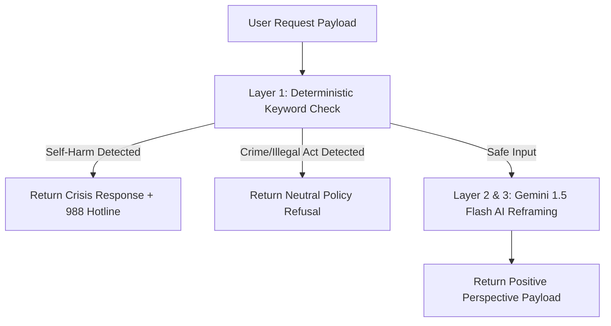

# 📖 From Scratch: Beginner Deep-Dive Guide
*Silver Lining AI - Comparing React/Node.js to Flutter/Dart & Python/FastAPI*

---

## 🎯 Welcome to Full-Stack AI Engineering!

As a Frontend Engineer, you already know:
- **Languages**: JavaScript / TypeScript
- **UI Frameworks**: React / Next.js / HTML / CSS
- **Backend / Tooling**: Node.js / Express / npm / JSON / REST APIs

This guide explains **everything we set up from scratch**, comparing every single concept to your existing Web/React background!

---

## 📱 PART 1: MOBILE DEVELOPMENT (Dart & Flutter)

### 1.1 Language Comparison: Dart vs. TypeScript

Dart was built by Google specifically for client application UI. It looks almost identical to TypeScript!

| Feature | TypeScript (Web) | Dart (Flutter) |
|---|---|---|
| **Variables** | `const x = 10;` or `let y = "hi";` | `final x = 10;` or `String y = "hi";` |
| **Null Safety** | `string \| null` or `string?` | `String?` (Sound Null Safety built into compiler) |
| **Functions** | `const add = (a: number, b: number): number => a + b;` | `int add(int a, int b) { return a + b; }` |
| **Classes** | `class User { name: string; constructor(name: string) { this.name = name; } }` | `class User { final String name; const User({required this.name}); }` |
| **Async / Await** | `async () => await fetch(...)` | `Future<void> fetchData() async { await ... }` |

---

### 1.2 Rendering Engine: How Flutter Works vs. React

- **React (Web / React Native)**:
  - React manages a **Virtual DOM**. In browser, it updates real HTML DOM nodes (`<div>`, `<p>`). In React Native, it sends JSON bridge messages to native OS widgets (`UIButton`, `UILabel`).
- **Flutter**:
  - Flutter **does not use native OS widgets or HTML DOM**!
  - Instead, Flutter operates like a **game engine** (built on Impeller / Skia). It controls every single pixel on screen directly on a GPU Canvas. This is why Flutter apps run at a constant 60 FPS or 120 FPS across iOS, Android, Web, and Desktop with 100% pixel-perfect consistency!

---

### 1.3 Project Structure: Flutter `app/` vs. React App

```
silver_lining/app/
├── pubspec.yaml             <-- 📦 Equivalent to package.json
├── pubspec.lock             <-- Equivalent to package-lock.json
├── lib/                     <-- 🎯 Equivalent to /src in React
│   └── main.dart            <-- Application Entry Point (like src/App.tsx)
├── test/                    <-- Unit & Widget Tests (like __tests__)
├── android/                 <-- Native Android container (Gradle)
├── ios/                     <-- Native iOS container (Xcode)
└── web/                     <-- Web container (index.html)
```

#### `pubspec.yaml` vs. `package.json`

React (`package.json`):
```json
{
  "name": "silver-lining-app",
  "dependencies": {
    "react": "^18.2.0",
    "axios": "^1.6.0"
  }
}
```

Flutter (`pubspec.yaml`):
```yaml
name: silver_lining_app
description: "AI Positivity Reframer Mobile App"

dependencies:
  flutter:
    sdk: flutter
  http: ^1.2.0              # API calls (like axios / fetch)
```

---

### 1.4 Component Architecture: Widgets vs. React Components

In Flutter, **Everything is a Widget**. There are two main types of widgets you must know:

#### A) `StatelessWidget` (Immutability = Pure React Functional Component)
Used when the UI depends ONLY on props/constructor parameters and never mutates internally.

```dart
class HeaderLogo extends StatelessWidget {
  final String title;
  const HeaderLogo({super.key, required this.title});

  @override
  Widget build(BuildContext context) {
    return Text(title, style: const TextStyle(fontWeight: FontWeight.bold));
  }
}
```

#### B) `StatefulWidget` (Stateful = React Component with `useState`)
Used when the UI needs to update when data changes (e.g. text input, loading spinner, AI output).

```dart
class HomeScreen extends StatefulWidget {
  const HomeScreen({super.key});

  @override
  State<HomeScreen> createState() => _HomeScreenState();
}

class _HomeScreenState extends State<HomeScreen> {
  bool _isLoading = false; // State variable (like const [isLoading, setIsLoading] = useState(false))

  void _submit() {
    setState(() {
      _isLoading = true; // Triggers UI re-render!
    });
  }

  @override
  Widget build(BuildContext context) {
    return _isLoading ? const CircularProgressIndicator() : const Text("Ready");
  }
}
```

---

### 1.5 UI Styling & Layout Cheat Sheet

| CSS / Flexbox Property | Flutter Widget / Property |
|---|---|
| `display: flex; flex-direction: row` | `Row(children: [...])` |
| `display: flex; flex-direction: column` | `Column(children: [...])` |
| `flex-wrap: wrap` | `Wrap(spacing: 8, children: [...])` |
| `padding: 16px` | `Padding(padding: EdgeInsets.all(16), child: ...)` |
| `margin-bottom: 16px` | `SizedBox(height: 16)` |
| `background-color`, `border-radius`, `box-shadow` | `Container(decoration: BoxDecoration(...))` |
| `backdrop-filter: blur(20px)` | `BackdropFilter(filter: ImageFilter.blur(...))` |

---

## 🐍 PART 2: BACKEND DEVELOPMENT (Python & FastAPI)

### 2.1 Language & Runtime: Python vs. Node.js

| Feature | Node.js (JavaScript / TypeScript) | Python 3.11 (FastAPI) |
|---|---|---|
| **Package Installer** | `npm install axios` | `pip install httpx` |
| **Dependency Manifest** | `package.json` | `requirements.txt` / `pyproject.toml` |
| **Isolated Environment** | `node_modules/` | `.venv/` (Virtual Environment) |
| **Server Engine** | Node.js HTTP / Express | Uvicorn (ASGI - Asynchronous Server Gateway Interface) |
| **Type Validation** | Zod (`z.object({ name: z.string() })`) | Pydantic (`class User(BaseModel): name: str`) |
| **API Documentation** | Manual Swagger UI | **Automatic Interactive Swagger UI** at `/docs` |

---

### 2.2 Backend Architecture & Project Structure

```
silver_lining/backend/
├── app/
│   ├── main.py              <-- FastAPI App & Route Endpoints
│   ├── models/
│   │   └── schemas.py       <-- Pydantic Data Models (DTOs)
│   └── services/
│       ├── safety_service.py <-- 3-Tier Safety Engine Logic
│       └── llm_service.py   <-- Gemini 1.5 Flash AI Service
├── requirements.txt         <-- Dependencies
└── Dockerfile               <-- Container Configuration
```

---

### 2.3 Pydantic Data Models vs. Zod (Type Safety)

In TypeScript with Zod:
```typescript
import { z } from 'zod';

export const ReframeRequestSchema = z.object({
  input_text: z.string().min(1)
});

export type ReframeRequest = z.infer<typeof ReframeRequestSchema>;
```

In Python with Pydantic (`app/models/schemas.py`):
```python
from pydantic import BaseModel, Field

class ReframeRequest(BaseModel):
    input_text: str = Field(..., min_length=1, description="User's thought to reframe")
```

When a JSON request arrives at `POST /api/v1/reframe`, FastAPI **automatically validates** the request against `ReframeRequest`. If a user sends `{}` or an integer, FastAPI instantly rejects it with a clean HTTP 422 error!

---

### 2.4 3-Tier AI Safety Engine Logic



1. **Layer 1 (Pre-filter)**: Instant in-memory check for crisis keywords (`suicide`, `hurt myself`) or crime keywords (`stole`, `robbed`). Executes in **< 1 millisecond**!
2. **Layer 2 (Prompt Guardrail)**: Instructs Gemini 1.5 Flash to act strictly as an empathetic psychological perspective coach.
3. **Layer 3 (Output Sanitizer)**: Pydantic payload validation ensures unsafe text never reaches the mobile user.
